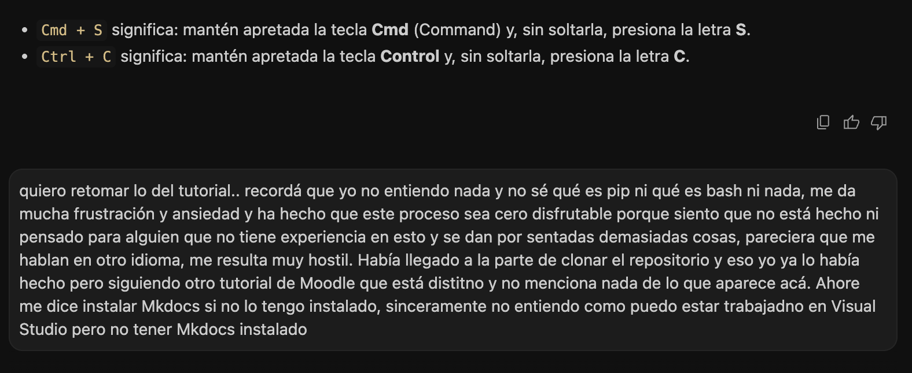
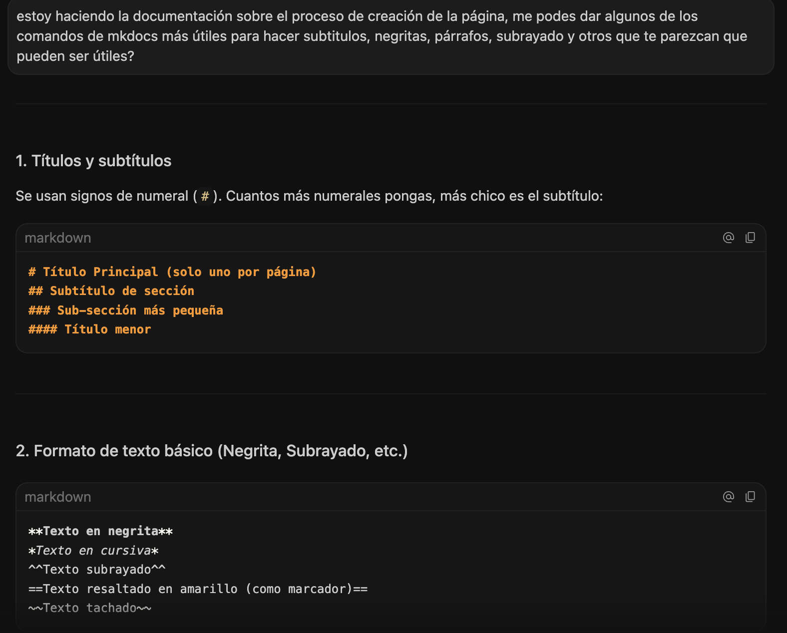

## Proceso de creación de mi sitio web:

Rápidamente me di cuenta de que iba a ser bastante más complejo de lo que inicialmente me imaginaba, hay algo del *idioma* del mundo de la programación que desconocía y que se me hacía muy ageno. Además, arranqué la especialización usando una Mac por primera vez en mi vida, lo cual también me implicaba aprender a usar una máquina que funciona de forma bastante distinta a lo que conocía.

En todo el proceso de intentar seguir los tutoriales, aprender a usar la máquina y entender lo que estaba haciendo, usé mucho mi chat con Antigravity tanto para preguntarle comandos de la Mac como para que me ayudara a seguir los tutoriales, a continuación adjunto una captura que refleja bastante bien cómo me sentía:

Me llevó un montón de días lograr dejar todo funcionando. Consideré usar Antigravity para editar texto plano pero la propia IA me sugirió que sin experiencia era más fácil usar Visual Studio y había mucha mas info y tutoriales disponibles, así que estoy usando Visual.

Durante todo el proceso de instalación, estaba muy atenta a los comandos específicos de Mac, por ejemplo debía usar Python3 y Pip3 en vez de Python y pip. Esas cosas me resultaban cero obvias y me complicaron el proceso. Otro ejemplo fue el hecho de que logré familiarizarme con qué era y cómo usar la Terminal de Mac, pero capaz luego durante las clases, por momentos hacían referencia a: "Vayan a la consola". Mi reacción era: uy pero qué es la consola? yo no instalé eso! y así podría dar mil ejemplos.

Para mi es como que a alguien que no sabe tejer, decirle, agarrá las agujas y avisame cuando vayas en la carrera número 3, pero la persona todavía se está preguntando cómo se agarran las agujas!!

Fue un proceso bastante "desordenado" donde avancé en cosas al mismo tiempo que solucionaba problemas, pero una vez que pude dejar la página pública me pude finalmente sentar a explorar las funciones para mejorarla, editar, agregar imágenes, etc. Le pedí a la IA que me haga una lista de las reglas de sintaxis (aunque yo les digo comandos) más útiles para trabajar con texto plano y es lo que he ido usando para editar todo.

Instalé el Markdown editor en Visual Studio y voy cambiando de ese modo a Text Editor porque para algunas cosas como poner imágenes me sirve mas en ese modo. Sé que podría poner ambas vistas en simultáneo pero no he llegado a eso.

Siento que podría haber sido un proceso más disfrutable y si por esas casualidades de la vida, hay alguien de las ciencias sociales leyendo esto, vení, agarrame la manito: todo va a estar bien. No te olvides de apretar command y la S.
