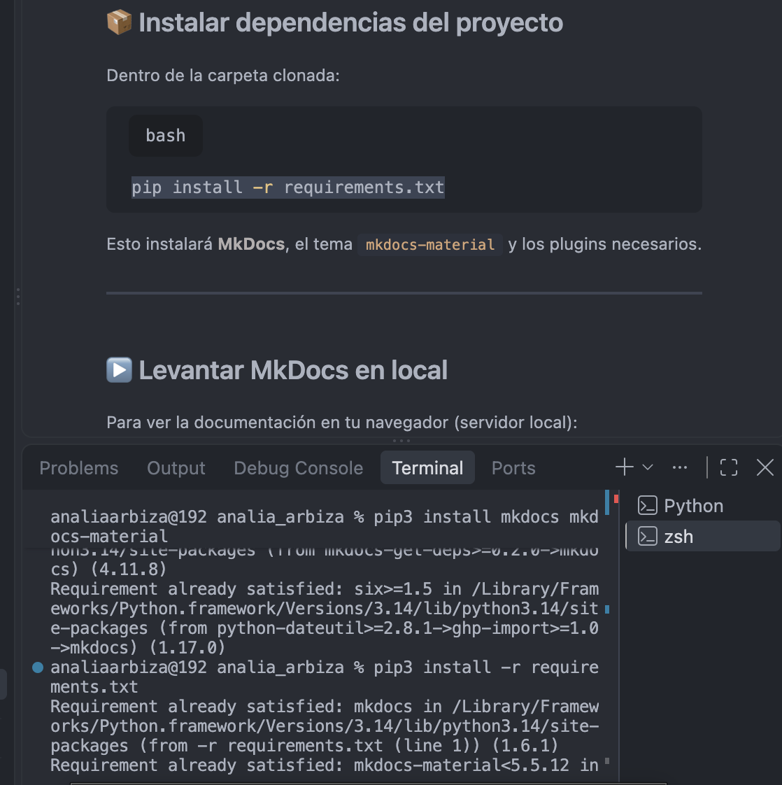

## Proceso de creación de mi sitio web:

Rápidamente me di cuenta que iba a ser bastante más complejo de lo que inicialmente me imaginaba, hay algo del *idioma* del mundo de la programación que desconocía y que se me hacía muy ageno. Además, arranqué la especialización usando una Mac por primera vez en mi vida, lo cual también me implicaba aprender a usar una máquina que funciona de forma bastante distinta a lo que conocía.

En todo el proceso de intentar seguir los tutoriales, aprender a usar la máquina y entender lo que estaba haciendo, usé mucho mi chat con Antigravity tanto para preguntarle comandos de la Mac como para que me ayudara a seguir los tutoriales, a continuación adjunto una captura que refleja bastante bien cómo me sentía:

Me llevó un montón de días lograr dejar todo funcionando. Estaba muy atenta a los comandos específicos de mac, por ejemplo debía usar Python3 y Pip3 en vez de Python y pip. Esas cosas me resultaban cero obvias y me complicaron el proceso. Otro ejemplo fue el hecho de que logré familiarizarme con qué era y cómo usar la Terminal de mac pero capaz luego durante las clases, por momentos hacían referencia a: "Vayan a la consola". Mi reacción era: uy pero qué es la consola? yo no instalé eso! y así podría dar mil ejemplos.

Para mi es como que a alguien que no sabe tejer, decirle, agarrá las agujas y avisame cuando vayas en la carrera número 3 y la persona se está preguntando cómo se agarran als agujas!!
